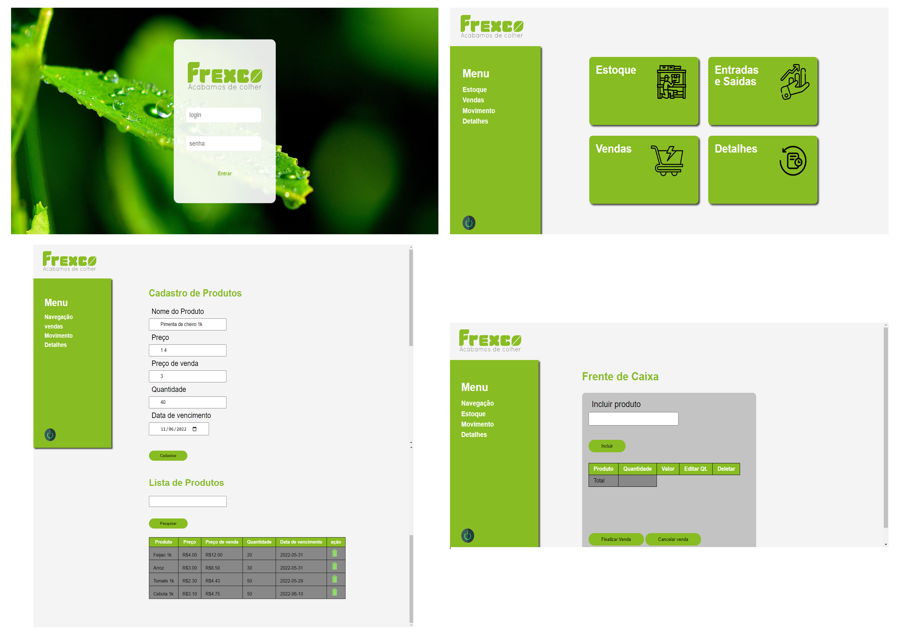

# Desafio Frexco 
<h1 align="center">Incompleto,  em desenvolvimento</h1>

# Sobre
<h2>Frexco</h2>

    Desafio Full Stack Developer

Objetivo: Você foi contratado para criar uma aplicação de controle de estoque. Cada vez que um produto for vendido o mesmo deverá ser debitado do estoque. Sugerimos dividir a aplicação nas seguintes telas:

• Criação, edição, deleção de produto

• Criação, edição, deleção de estoque

• Listagem de produtos x estoque, deleção de produto x estoque A completude e uso das melhores práticas de desenvolvimento serão levadas em conta nesta avaliação.

Requisitos:

• Todo o código deverá ser versionado e publicado para a apresentação em repositório git.

• As seguintes tecnologias e princípios deverão ser aplicadas: reactjs, materialUi, banco de dados: postgree ou sqlite ou mongodb, nodejs, Clean architeture ou DDD, Git.

• Serão considerados diferenciais: Docker compose com geração do front, back e banco de dados. Tela de login com validação via JWT. Uso de typescript tanto para o backend quanto para o frontend.   
    

 
    Neste projeto estou implementando um design de fácil navegação e agradavel visualmente, de acordo com cores e padrão da marca e didático para utilização usuário.

# Caracteristicas

- [x] Elemententos HTML semântico.
- [x] CSS-BEM.
- [] Responsivo. 
- [x] inclusão de produtos no estoque
- [] integração com banco de dados mongodb 
- [x] Login (usuário: admin | senha: frexco ).
- [] login com validação JWT
- [x] animações.

# Autor
Made for Lucas Martins </> [see my linkedIn](www.linkedin.com/in/lucas-martins-desenvolvedor)
